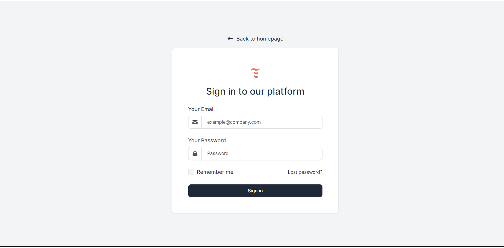
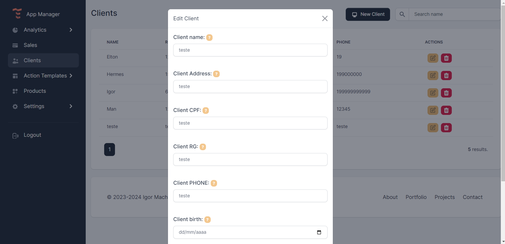

# APPLICATION MANAGER FOR COMMERCES.
Application under development for managing customers, sales, products and displaying revenues, expenses and monthly sales graphs and reports.

Developed with JS, NodeJS, ReactJS, Bcrypt, AES, sequelize, MySql Workbench, express, axios, morgan, nodemon and others.

## HOW RUN?
1º - download the pastes.
2º - download Sql Server and Workbench.
3º - run in terminal 'npm install' in frontend and backend folders.
4° - create de DB, migrations and seeders (support file in backend folder).
5º - run npm run dev in backend folder.
6º - run npm run start in frontend folder.
7º - good use!

## SCREENSHOTS
Login page.

Settings page.

Clients page.

Products page.

